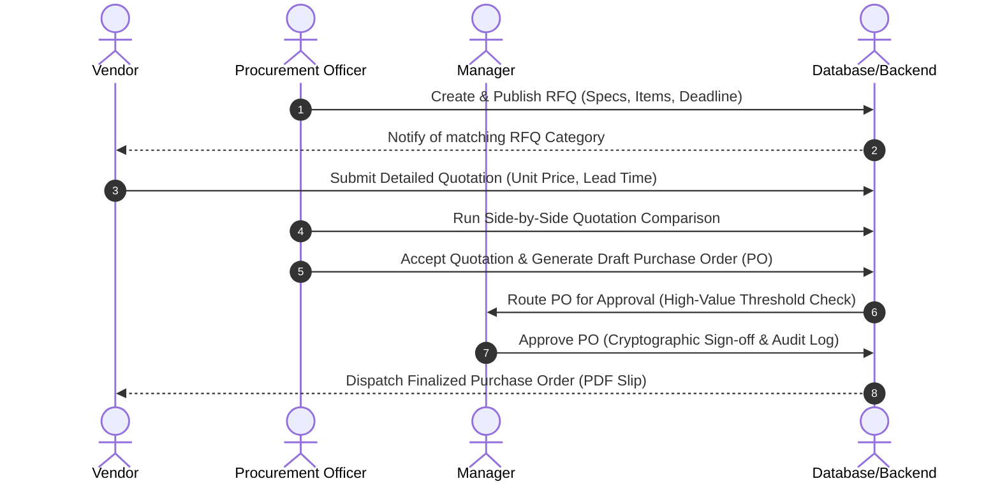
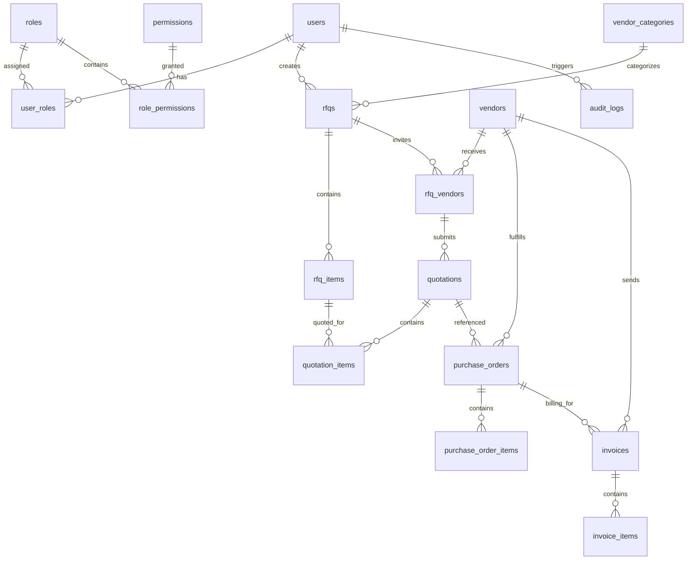

<p align="center">
  
</p>

# 🌐 VendorBridge

### **Intelligent, Enterprise-Grade Vendor Management & Collaborative Procurement SaaS**

---

<p align="center">
  <a href="https://vendorbridge-backend.onrender.com"></a>
  <a href="https://nextjs.org"></a>
  <a href="https://expressjs.com"></a>
  <a href="https://prisma.io"></a>
  <a href="https://postgresql.org"></a>
  <a href="https://docker.com"></a>
</p>

---

## 🎯 Value Proposition

**VendorBridge** is a modern, enterprise-ready **AI-Powered Vendor Management & Procurement SaaS Platform** that bridges the communication and operational gap between corporate procurement officers, internal financial/department managers, and third-party vendors. By automating manual Request for Quotation (RFQ) cycles, tracking compliance metrics, performing intelligent bid evaluations, and routing multi-step purchase order approvals, VendorBridge accelerates corporate procurement while ensuring absolute transparency and compliance.

---

## 🚨 The Problem

Modern enterprise procurement is heavily bottlenecked by legacy systems, offline communication channels, and administrative friction:
* 📉 **Frictional Communication:** Procurement officers spend hours manually emailing spreadsheets, specs, and deadlines to vendors, resulting in scattered threads and lost bids.
* 🛡️ **Zero Audit Compliance:** Bidding processes occur offline, making the evaluation opaque, exposing organizations to compliance flags, and complicating audit trails.
* ⏱️ **Delayed Purchase Approvals:** Internal approval chains for purchase orders rely on verbal sign-offs or manual email routing, stalling production and delivery.
* 📂 **High Administrative Overhead:** Manually verifying supplier registration, calculating trust scores, and manually matching incoming invoices against purchase orders creates immense administrative lag.

---

## 💡 The Solution

VendorBridge solves these problems through a single, secure, decoupled SaaS platform designed for high-throughput procurement operations:
* 🤝 **Unified Collaboration Portal:** Vendors self-register, onboard via interactive steps, and submit detailed digital quotations directly against active RFQs.
* 📊 **Smart Side-by-Side Bidding Evaluations:** Procurement officers compare vendor bids in real-time on price, delivery lead times, and overall trust score.
* ⚡ **Automated Multi-Step Approval Workflows:** System automatically routes purchase orders to managers based on value thresholds, recording cryptographic audit histories.
* 🎯 **Dynamic Dashboards:** Each role accesses custom interfaces tracking spend velocity, active RFQs, and performance metrics, powered by responsive frontend caching.

---

## ✨ Key Features

### 👤 Multi-Role Unified Dashboards
Tailored interfaces with distinct page structures for **Admins**, **Procurement Officers**, **Managers**, and **Vendors**, aligning views to their specific permissions.

### 📋 Request for Quotation (RFQ) Pipeline
Create structural RFQs indicating line items (description, quantities, unit specs), set bidding deadlines, attach project documentation, and target specific vendor segments.

### ⚖️ Side-by-Side Quotation Analysis
Compare incoming vendor bids dynamically. Highlight minimum price bids, best delivery speeds, and highest vendor trust ratings in a clean, comparative grid interface.

### 🚦 Cryptographic Approval Chains
Draft Purchase Orders (POs) automatically once a quotation is accepted. Route approvals dynamically, allowing managers to sign off with explicit remarks and historical audit logs.

### 📊 Real-Time Analytics & Spend Distribution
Rich charts showing spend analytics by vendor categories, cost savings summaries, open RFQ metrics, and outstanding payments.

### 🔒 Enterprise-Grade RBAC
Strict role-based middleware guards every API controller and frontend view, verifying permission scopes (`rfq.*`, `purchase_order.approve`, etc.) dynamically.

---

## 🤖 Innovation & Intelligence

* 📈 **Dynamic Trust & Performance Scoring:** The platform tracks historical vendor deliverables, evaluating them on **Quality Score**, **Delivery Speed**, **Responsiveness**, and **User Rating**. High-risk vendors are automatically flagged, safeguarding enterprise resources.
* ⚡ **Frictionless Auto-Login Onboarding:** A modern, conversion-optimized signup flow. New users registering a workspace are automatically provisioned, marked active, signed in via session-based JWTs, and seamlessly redirected to their customizable onboarding setup wizard.

---

## 🏗️ System Architecture

VendorBridge is built on a decoupled, secure, multi-tier architecture to support high traffic and isolated scaling:

```
graph TD
    subgraph Client Layer
        A[Next.js Web Client] -->|React / Zustand / Tailwind| B(State Sync / UI Routing)
    end

    subgraph API Gateway / BFF
        C[Next.js App API Router] -->|Secure Session / Proxy| D[Next.js BFF Gateway]
    end

    subgraph Service Layer
        E[Express.js REST Server] -->|RBAC Guard / Zod Validation| F[Core Modules]
        F -->|Auth Service| G[Authentication]
        F -->|Procurement Service| H[RFQ / Quotation / PO]
        F -->|Vendor Service| I[Trust Scoring]
    end

    subgraph Data & Logging Layer
        J[Prisma ORM Client] -->|PG Pool Adapter| K[(PostgreSQL Database)]
        L[Redis Client] -->|Session / Audit Cache| M[(Redis Session Store)]
        N[Winston Logger] -->|Daily Log Rotation| O[File Stream / Console]
    end

    Client Layer -->|HTTP / Cookies / Session| API Gateway / BFF
    API Gateway / BFF -->|Bearer Token Auth / JWT| Service Layer
    Service Layer --> J
    Service Layer --> L
    Service Layer --> N
```

---

## 🛠️ Tech Stack

| Layer | Technology | Version | Purpose |
|---|---|---|---|
| **Frontend** | [Next.js](https://nextjs.org/) | `16.2.7` | Production SSR & Dynamic App Routing (BFF) |
| **Frontend UI** | [React](https://react.dev/) / Tailwind CSS | `19.2.4` / `4.0` | High-fidelity UI Elements & Slick Dark Mode Layouts |
| **State Management** | [Zustand](https://github.com/pmndrs/zustand) | `5.0.14` | Light, reactive, persistent global client-side store |
| **Backend** | [Express.js](https://expressjs.com/) | `5.2.1` | Decoupled RESTful API Server |
| **ORM** | [Prisma](https://www.prisma.io/) | `7.8.0` | Type-safe schema definitions & PG driver pooling |
| **Database** | [PostgreSQL](https://www.postgresql.org/) | `16` | Relational storage with strict constraints and cascade rules |
| **Caching & Audit** | [Redis](https://redis.io/) | `7` | Cache tier for analytics endpoints & user session tokens |
| **Containerization** | [Docker](https://www.docker.com/) | Compose `3.8` | Standardized environment isolation |

---

## 📁 Project Structure

```
Odoo-x-KSV-Hackathon/
├── Frontend/                 # Next.js BFF & React UI Application
│   ├── src/
│   │   ├── app/              # Routes, BFF Proxies, & Dashboard Pages
│   │   ├── components/       # UI Components, Auth Providers, & Custom Layouts
│   │   └── lib/              # API Client Services & Zustand State Store
│   ├── package.json          # Frontend build scripts and dependencies
│   └── tsconfig.json         # TypeScript configuration
├── backend/                  # Decoupled Express.js REST API Server
│   ├── src/
│   │   ├── config/           # Database pools, Redis instances, & Winston Loggers
│   │   ├── middleware/       # JWT validators, RBAC guards, & rate limiters
│   │   └── modules/          # Business logic modules (Auth, RFQ, PO, Vendors)
│   ├── prisma/               # Schema, Migration files, & Database Seed Scripts
│   ├── package.json          # Backend build scripts and dependencies
│   └── docker-compose.yml    # Database Container Orchestration
├── render.yaml               # Infrastructure-as-Code (IaC) Render Deploy Spec
└── README.md                 # Main Documentation (This File)
```

---

## 👥 User Roles & Permissions

| Role | Primary Dashboard | Key Actions | Permitted Scopes |
|---|---|---|---|
| **Admin** | `/admin/dashboard` | Manage user registrations, configure system parameters, view global audit logs. | `user.*`, `role.*`, `audit.read` |
| **Procurement Officer** | `/procurement/dashboard` | Draft and publish RFQs, compare incoming bids, initiate purchase orders, view vendors. | `rfq.*`, `quotation.read`, `purchase_order.create` |
| **Manager** | `/manager/dashboard` | Review high-value POs, approve/reject transactions, view aggregate cost analytics. | `purchase_order.approve`, `analytics.read` |
| **Vendor** | `/vendor/dashboard` | Complete profile details, review open RFQs, submit bid quotations, track approved POs. | `rfq.read`, `quotation.create`, `purchase_order.read` |

---

## 🔄 Procurement Lifecycle Workflow



---

## 🚀 Setup & Installation Instructions

Follow these steps to run VendorBridge locally in a development environment:

### Prerequisites
- **Node.js** v20+ installed
- **Docker** and **Docker Compose** running on your system

---

### Clone the Repository & Start Databases
Spin up isolated PostgreSQL and Redis databases using Docker:
```bash
# Navigate to the backend directory
cd backend

# Start Postgres (Port 5433) and Redis (Port 6380)
npm run docker:up
```

---

###  Run Migrations & Seed the Database
Deploy database schemas and seed default roles, permissions, categories, and test users:
```bash
# Install backend dependencies
npm install

# Run migration, generate Prisma client, and seed tables
npm run setup
```

---

### Step 4: Boot the Backend Server
Start the Express REST API backend:
```bash
# Start backend in development watch mode
npm run dev
```
*The backend server will run on `http://localhost:5000`. Direct health checks can be verified at `http://localhost:5000/health`.*

---

### Step 5: Boot the Frontend client
In a new terminal window, navigate to the Frontend folder and run the client:
```bash
# Navigate to Frontend folder
cd Frontend

# Install Frontend dependencies
npm install

# Start development Next.js dev server
npm run dev
```
*Open `http://localhost:3000` in your browser to view the application.*

---

## 🔌 API Reference (Overview)

### Authentication
* `POST /api/v1/auth/register` — Form registration with automatic workspace creation and auto-login proxy.
* `POST /api/v1/auth/login` — Session credentials exchange.
* `POST /api/v1/auth/logout` — Token revocation and session invalidation.
* `POST /api/v1/auth/refresh-token` — Silent refresh for access token longevity.

### RFQ & Bid Management
* `GET /api/v1/rfqs` — Retrieve active/published RFQs filtered by categories.
* `POST /api/v1/rfqs` — Create a new RFQ line-item specification (Procurement Officer).
* `PATCH /api/v1/rfqs/:id/publish` — Open bidding pipeline for vendors.
* `GET /api/v1/rfqs/:id/compare` — Dynamic comparison payload of submitted quotations.

### Purchase Orders & Approvals
* `POST /api/v1/purchase-orders` — Convert accepted vendor quotations to draft POs.
* `PATCH /api/v1/purchase-orders/:id/status` — Approve or reject PO workflows (Manager).
* `GET /api/v1/purchase-orders/:id/pdf` — Retrieve transactional PDF receipts.

---

## 💾 Database Design Summary

Our PostgreSQL schema maps the complex procurement workflow through highly optimized models with relational constraints:



* **Relational Security:** Enforces cascade-delete on configuration joins while preventing delete operations on active transactional data (Purchase Orders, Invoices).
* **Indexing Strategy:** Composite indexes placed on foreign key relationships (`rfq_id`, `vendor_id`) and status fields to guarantee high-performance search queries.
* **Audit Integrity:** Relies on immutable `audit_logs` tracking structural modifications (`INSERT`, `UPDATE`, `DELETE`) showing old vs new JSON structures for absolute tracking.

---

## 🔒 Security & Defensive Features

* 🔐 **Next.js BFF Token Splitting:** Prevents Cross-Site Scripting (XSS) by isolating API keys. Next.js App proxy abstracts Express tokens and saves them in secure, `httpOnly`, same-site cookies.
* 🛡️ **Salted Password Hashing:** User passwords are encrypted using `bcrypt` with `12` hashing rounds, locking them against dictionary attacks.
* 🚦 **Dynamic CORS Restrictions:** Whitelists frontend clients strictly, preventing cross-domain request forgery.
* ⏳ **API Rate Limiting:** Core authorization interfaces (login, signup, reset) are protected by rate limiters to prevent automated brute-force attacks.
* 💡 **Input Schema Sanitization:** Every API endpoint verifies inputs against strict structural schemas defined in `Zod`, rejecting structural injections.

---

## 🌐 Enterprise Scalability Design

* **Decoupled Monorepo Structure:** Frontend (Next.js Node engine) and Backend (Express runtime) operate independently, allowing developers to scale UI rendering separate from database query processing.
* **High Performance Caching:** Integrates `Redis` as a fast cache layer to store recurrent dashboard analytics and read-heavy statistics, offloading high-overhead PostgreSQL operations.
* **Standardized Environments:** Uses `Docker Compose` configurations to ensure development environment parity with production servers, easing continuous deployment pipelines.

---

## 🎥 Live Demo & Preview

* **Production Application Link:** [Launch VendorBridge Web Client](https://vendorbridge-frontend.onrender.com)
* **Video Pitch & System Walkthrough:** [Watch Project Pitch on YouTube (Placeholder)](#)

---

## 📄 Documentation

For a comprehensive review of the design, complete feature scope, business model, and project milestones, view our primary product document:
👉 **[Official Google Docs Documentation & Specification](https://docs.google.com/document/d/1EgV-bUD5SI5fKgIxdr-X0MjdYAFHHwvan0qX9KvEpTU/edit?usp=sharing)**

---

## 👥 Development Team

* **Krishna Prajapati** — Full Stack Software Engineer
* **Dev Darji** — Full Stack Software Engineer,Data Scientist 

---

## 🔮 Future Enhancements

1. ⚡ **Smart Contract Escrow:** Move purchase order payment authorizations onto decentralized contracts for friction-free cross-border settlements.
2. 🤖 **Three-Way Invoice Matching OCR:** Scan incoming vendor invoice papers using Optical Character Recognition (OCR), dynamically verifying quantity/price alignments between Purchase Orders and Delivery Slips.
3. 📉 **Predictive Spend Analytics:** Run machine learning algorithms on historical RFQ data to forecast category market trends and suggest budget optimization caps.

---

## 🏆 Why VendorBridge is a Winning Hackathon Entry

1. **Clear Business Impact:** Solves a multi-billion dollar enterprise operational bottleneck with structured digital workflows, saving organizations up to 25% in procurement cycle times.
2. **Deep Technical Sophistication:** Built using modern frameworks, a type-safe DB architecture (Prisma 7, PostgreSQL adapter pools), Next.js BFF proxy, and Redis caching.
3. **Outstanding UX & Enterprise Readiness:** High-fidelity metrics cards, smooth onboarding redirect wizards, responsive grids, and detailed dark-themed styling.
4. **Uncompromising Security Standards:** Implements session cookie abstraction, strict RBAC layers, input validation, and daily audit logging natively.
